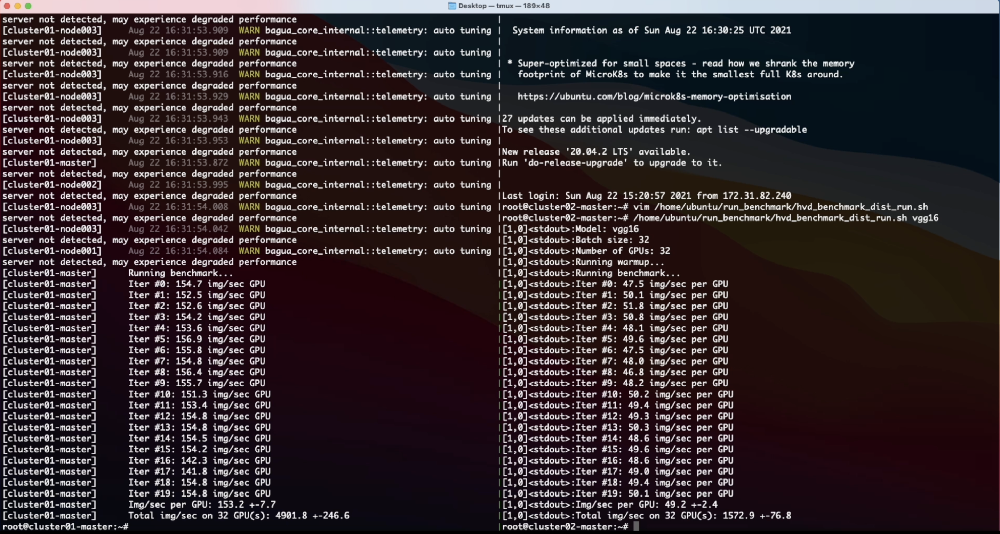

<p align="center">

</p>
<hr/>

[](https://bagua-tutorials.kwai-seattle.com/) [](http://bagua.readthedocs.io/?badge=latest) [](https://pypi.org/project/bagua/) [](https://hub.docker.com/r/baguasys/bagua) [](https://hub.docker.com/r/baguasys/bagua) [](https://github.com/BaguaSys/bagua/blob/master/LICENSE)

Bagua is a distributed training utility developed by [AI platform@Kuaishou Technology](https://www.kuaishou.com/en) and [DS3 Lab@ETH](https://ds3lab.inf.ethz.ch/). Users can extend the training on a single GPU to multi-GPUs (may across multiple machines) by simply adding a few lines of code. One prominent feature of Bagua is to provide a flexible system abstraction that supports state-of-the-art system relaxation techniques of distributed training. Powered by the new system design, Bagua has a great ability to implement and extend various state-of-the-art distributed learning algorithms. This in turns enables better scalability and efficiency of the end-to-end training process.
Researchers can also easily develop new distributed training algorithms within the Bagua framework, without worrying about low-level optimizations.

So far, Bagua has integrated communication primitives including

- Centralized Synchronous Communication (AllReduce)
- Decentralized Synchronous Communication
- Low Precision Communication

Its effectiveness has been evaluated in various scenarios, including VGG and ResNet on ImageNet, BERT Large and many industrial applications at Kuaishou.

## Performance

<p align="center">
    
</p>
<p align="center">
    The performance of different systems and algorithms on VGG16 with 128 GPUs under different network bandwidth.
</p>

<br/>
<br/>

<p align="center">
    
</p>
<p align="center">
    Epoch time of BERT-Large Finetune under different network conditions for different systems.
</p>

For more comprehensive and up to date results, refer to [Bagua benchmark page](https://bagua-tutorials.kwai-seattle.com/benchmark/index.html).

## Installation & Quick Start

Develop version:

```
pip install git+https://github.com/BaguaSys/bagua.git
```

Release version:

```
pip install bagua
```

See [Bagua tutorials](https://bagua-tutorials.kwai-seattle.com/getting-started/) for quick start guide.

## Quick Start on AWS

Thanks to the [Amazon Machine Images (AMI)](https://docs.aws.amazon.com/AWSEC2/latest/UserGuide/AMIs.html), we can provide users an easy way to deploy and run Bagua on AWS EC2 clusters with flexible size of machines and a wide range of GPU types. Users can find our pre-installed Bagua image on EC2 by a unique AMI-ID that we publish here. 

| Bagua version  | AMI ID |  Region |
|---|---|---|
| 0.6.3 | ami-0e719d0e3e42b397e | us-east-1 |

To manage the EC2 cluster more efficiently, we use [Starcluster](http://star.mit.edu/cluster/) as a toolkit to manipulate the cluster. In the `config` file of Starcluster, there are a few configurations that need to be set up by users, including AWS credentials, cluster settings, etc. More information regarding the Starcluster configuration can be found in this [tutorial](http://star.mit.edu/cluster/docs/latest/quickstart.html). Note that AMI is a regional resource, so you need to specify the AMI ID and its corresponding EC2 region at the same time.

For example, we create a EC2 cluster with 4 machines (`p3.16xlarge`), each of which has 8 V100 GPUs. The cluster is based on the Bagua AMI we pre-installed in `us-east-1` region. Then the `config` file of Starcluster would be:

```yaml
# region of EC2 instances, here we choose us_east_1
AWS_REGION_NAME = us-east-1
AWS_REGION_HOST = ec2.us-east-1.amazonaws.com
# AMI ID of Bagua
NODE_IMAGE_ID = ami-0e719d0e3e42b397e
# number of instances
CLUSTER_SIZE = 4
# instance type
NODE_INSTANCE_TYPE = p3.16xlarge
```

With above setup, we created two identical clusters to benchmark a synthesized image classification task over Bagua and Horovod, respectively. Here is the screen recording video of this experiment.

<p align="center">
    <a href="https://youtu.be/G8o5HVYZJvs"></a>
</p>

## Cite Bagua

```bibtex
% System Overview
@misc{gan2021bagua,
  title={BAGUA: Scaling up Distributed Learning with System Relaxations}, 
  author={Shaoduo Gan and Xiangru Lian and Rui Wang and Jianbin Chang and Chengjun Liu and Hongmei Shi and Shengzhuo Zhang and Xianghong Li and Tengxu Sun and Jiawei Jiang and Binhang Yuan and Sen Yang and Ji Liu and Ce Zhang},
  year={2021},
  eprint={2107.01499},
  archivePrefix={arXiv},
  primaryClass={cs.LG}
}

% Theory on System Relaxation Techniques
@book{liu2020distributed,
  title={Distributed Learning Systems with First-Order Methods: An Introduction},
  author={Liu, J. and Zhang, C.},
  isbn={9781680837018},
  series={Foundations and trends in databases},
  url={https://books.google.com/books?id=vzQmzgEACAAJ},
  year={2020},
  publisher={now publishers}
}
```

## Limitations

* When communication is not a bottleneck in the training task, using Bagua communication algorithms will not provide significant performance improvement (unless you use other optimizations in Bagua such as fused optimizer).
* Currently only tested on Linux and NVIDIA GPUs.

## Discussion

Feel free to join our [Zulip chat](https://bagua.zulipchat.com) for discussion!

You can also scan the following QR code to join our WeChat group :)


## Links

* [Bagua Main Git Repo](https://github.com/BaguaSys/bagua)
* [Bagua Tutorials](https://bagua-tutorials.kwai-seattle.com/)
* [Bagua Examples](https://github.com/BaguaSys/bagua/tree/master/examples)
* [Bagua API Documentation](https://bagua.readthedocs.io/)
